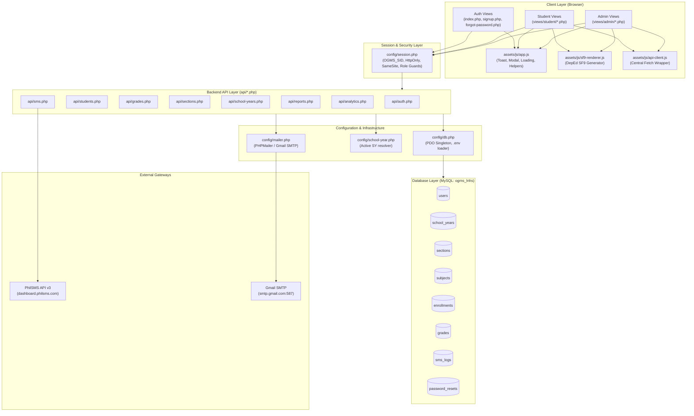
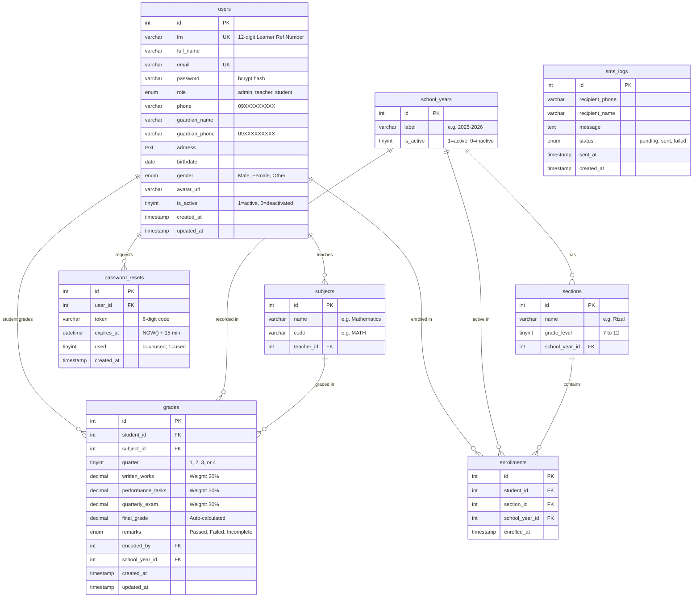

# OGMS System Memory — Lubo National High School
**Document Version:** 1.0.0  
**Last Updated:** September 12, 2026  
**Project Path:** `C:\xampp\htdocs\OGMS-Lubo-National-High-School`  
**Primary Engine:** PHP 8.2+ / MySQL 8.0+ (PDO) / Apache (XAMPP) / Vanilla JS ES6+ / Bootstrap 5.3  

---

## 📌 Executive Summary & Purpose

This document serves as the **authoritative system memory and synchronization ledger** for the **Online Grade Monitoring System (OGMS) of Lubo National High School**.

### Core Directive: Zero-Desynchronization Architecture
Whenever any developer, collaborator, or AI assistant:
1. **Edits or refactors an existing file, function, database column, or UI component**, or
2. **Introduces a new feature or module**,

They **MUST** consult this document, trace all upstream and downstream connections via the [Connection & Synchronization Matrix](#-end-to-end-connection--synchronization-matrix), update all interconnected files simultaneously, and record the modification in the [Living Synchronization Log](#-living-synchronization-log).

---

## 🏛️ System Architecture Overview



---

## 🗂️ Master File Inventory & Roles

| Relative File Path | Type / Layer | Primary Responsibility | Direct Dependencies (Requires) | Inbound Callers / Consumers |
|---|---|---|---|---|
| `config/db.php` | Config / Database | Loads `.env`, defines DB/SMTP/SMS constants, provides `getDB(): PDO` singleton | `.env` | All `api/*.php`, `config/mailer.php`, `test-mail.php` |
| `config/session.php` | Config / Auth | Starts secure `OGMS_SID`, guards routes (`requireLogin`, `requireAdmin`, `requireStudent`), provides `jsonResponse()` | None | All `api/*.php`, `views/*/*.php`, `index.php` |
| `config/school-year.php` | Config / Helper | Resolves active academic year ID (`activeSchoolYear`) and label | `config/db.php` | `api/students.php`, `api/grades.php`, `api/sections.php`, `api/reports.php`, `api/sms.php`, `api/school-years.php` |
| `config/mailer.php` | Config / Integration | Sends HTML emails using PHPMailer via Gmail SMTP TLS | `vendor/autoload.php`, `config/db.php` | `api/auth.php` (`reset_request`), `test-mail.php` |
| `config/test-connection.php` | Diagnostics | Validates PDO connectivity and outputs table record counts | `config/db.php` | Developer CLI / Debug |
| `api/auth.php` | API Endpoint | Handles `login`, `logout`, `check`, `reset_request`, `reset_confirm` | `config/db.php`, `config/session.php`, `config/mailer.php` | `index.php`, `views/student/forgot-password.php` |
| `api/students.php` | API Endpoint | Student CRUD: `list`, `get`, `register`, `update`, `delete` | `config/db.php`, `config/session.php`, `config/school-year.php` | `views/admin/manage-students.php`, `views/student/profile.php`, `views/student/signup.php`, `views/admin/profile.php` |
| `api/grades.php` | API Endpoint | Grade & Subject CRUD: `list`, `save`, `delete`, `add_subject`, `delete_subject`, `restore_subjects` | `config/db.php`, `config/session.php`, `config/school-year.php` | `views/admin/manage-grades.php`, `views/student/grades.php`, `views/student/analytics.php` |
| `api/sections.php` | API Endpoint | Section & Enrollment CRUD: `list`, `students`, `save`, `delete`, `enroll`, `unenroll` | `config/db.php`, `config/session.php`, `config/school-year.php` | `views/admin/manage-sections.php`, `views/admin/manage-students.php`, `views/admin/manage-grades.php` |
| `api/school-years.php` | API Endpoint | Academic Year management: `active`, `list`, `save`, `activate`, `delete` | `config/db.php`, `config/session.php`, `config/school-year.php` | `views/admin/school-years.php`, `views/student/dashboard.php` |
| `api/reports.php` | API Endpoint | Compiles DepEd SF9 & class analytics: `class`, `subject`, `student` | `config/db.php`, `config/session.php`, `config/school-year.php` | `views/admin/reports.php`, `views/student/reports.php` |
| `api/analytics.php` | API Endpoint | Aggregates KPIs, distributions, trends, rankings: `summary` | `config/db.php`, `config/session.php` | `views/admin/dashboard.php`, `views/admin/analytics.php`, `views/admin/profile.php` |
| `api/sms.php` | API Endpoint | Grade SMS generation & PhilSMS API v3 dispatcher: `options`, `preview`, `logs`, `send`, `clear_logs` | `config/db.php`, `config/session.php`, `config/school-year.php` | `views/admin/sms.php` |
| `index.php` | View / Auth | User login gateway (Tabs for Student and Admin, password eye toggle, brute lockout handling) | `config/session.php`, `assets/css/style.css` | Public entry point |
| `logout.php` | Controller | Destroys PHP session, clears cookies, redirects to `index.php` | `config/session.php` | Sidebars & User menus |
| `components/admin-sidebar.php` | View Component | Reusable navigation sidebar for administrative pages with active state highlighting | Session (`$_SESSION['full_name']`) | Included by all `views/admin/*.php` |
| `components/student-sidebar.php` | View Component | Reusable navigation sidebar for student portal pages with active state highlighting | Session (`$_SESSION['full_name']`) | Included by all `views/student/*.php` |
| `assets/js/app.js` | Client Script | Global UI utilities: Toast notifications, loading spinners, date formatters, grade color badges, mobile sidebar toggle | DOM, FontAwesome | Loaded by all views |
| `assets/js/api-client.js` | Client Script | Standardized wrapper for `fetch` GET/POST requests | DOM | Available across views |
| `assets/js/sf9-renderer.js` | Client Script | DepEd Form 9 (SF9) front-and-back report card rendering engine (JHS & SHS support) | `assets/css/sf9.css`, `assets/css/print.css` | `views/admin/reports.php`, `views/student/reports.php`, `test-page/index.php` |
| `assets/css/style.css` | Stylesheet | Core design system, CSS variables, dark-mode/light-mode variables, layout, tables, badges | None | All views |
| `assets/css/sf9.css` | Stylesheet | Pixel-perfect DepEd SF9 report card layout for on-screen preview and letter-sized printing | None | `views/admin/reports.php`, `views/student/reports.php`, `test-page/index.php` |
| `assets/css/print.css` | Stylesheet | Print-only stylesheet hiding navigation, buttons, and headers when printing reports | None | `views/admin/reports.php`, `views/student/reports.php` |

---

## 🗄️ Database Architecture & Schema Registry

**Database Name:** `ogms_lnhs`  
**Collation:** `utf8mb4_unicode_ci`  
**Default Engine:** `InnoDB`  



### Table Details & Field Constraints

#### 1. `users`
- **Key Constraints:** `PRIMARY KEY (id)`, `UNIQUE (email)`, `UNIQUE (lrn)`.
- **Validation Rules:**
  - `lrn`: Exactly 12 numeric digits (`/^\d{12}$/`), nullable for admin/teachers.
  - `phone`, `guardian_phone`: Philippine mobile number format (`/^09\d{9}$/`).
  - `role`: Enum `admin`, `teacher`, `student`.

#### 2. `school_years`
- **Key Constraints:** `PRIMARY KEY (id)`.
- **Business Rule:** Exactly one record should have `is_active = 1`. Managed transactionally in `api/school-years.php` (`action=activate`).
- **Format:** `YYYY-YYYY` with consecutive years (e.g., `2025-2026`).

#### 3. `sections`
- **Key Constraints:** `PRIMARY KEY (id)`, `FOREIGN KEY (school_year_id) REFERENCES school_years(id)`.
- **Unique Constraint:** `uq_section (name, grade_level, school_year_id)` — prevents duplicate section names within the same grade and academic year.
- **Foreign Key Guard:** Cannot be deleted if referenced in `enrollments`.

#### 4. `subjects`
- **Key Constraints:** `PRIMARY KEY (id)`, `FOREIGN KEY (teacher_id) REFERENCES users(id)`.
- **Standard Subjects (DepEd JHS):**
  1. `Araling Panlipunan` (`AP`)
  2. `Mathematics` (`MATH`)
  3. `Science` (`SCI`)
  4. `English` (`ENG`)
  5. `Filipino` (`FIL`)
  6. `MAPEH` (`MAPEH`)
  7. `TLE` (`TLE`)
  8. `Values Education` (`VE`)

#### 5. `enrollments`
- **Key Constraints:** `PRIMARY KEY (id)`, `UNIQUE KEY uq_enrollment (student_id, school_year_id)`.
- Enforces that a student can only belong to **one section per academic school year**.

#### 6. `grades`
- **Key Constraints:** `PRIMARY KEY (id)`, `UNIQUE KEY uq_grade (student_id, subject_id, quarter, school_year_id)`.
- **DepEd Formula:** `final_grade = round((WW * 0.20) + (PT * 0.50) + (QE * 0.30), 2)`
- **Remarks:** `>= 75.00 => 'Passed'`, `< 75.00 => 'Failed'`.
- **Upsert Rule:** Saved via MySQL `ON DUPLICATE KEY UPDATE` to avoid duplicate rows.

#### 7. `sms_logs`
- Stores all SMS dispatches initiated via PhilSMS or simulation.
- `status`: `'pending'`, `'sent'`, `'failed'`.

#### 8. `password_resets`
- Stores temporary 6-digit numeric verification tokens.
- Expiration: MySQL `NOW() + INTERVAL 15 MINUTE`.
- Protected by brute-force attempt limits (10 attempts max per session).

---

## ⚙️ Functions & Methods Directory

### 1. PHP Global Configuration Functions

```php
// config/db.php
function getDB(): PDO
// Returns singleton PDO instance configured with ERRMODE_EXCEPTION, FETCH_ASSOC, EMULATE_PREPARES=false.
```

```php
// config/session.php
function isApiRequest(): bool
// Detects if the current request is an API request via URI match with '/api/'.

function requireLogin(): void
// Halts execution and redirects to index.php (or returns 401 JSON) if $_SESSION['user_id'] is empty.

function requireAdmin(): void
// Enforces requireLogin() + $_SESSION['role'] === 'admin'. Redirects to student dashboard (or 403 JSON).

function requireStudent(): void
// Enforces requireLogin() + $_SESSION['role'] === 'student'. Redirects to admin dashboard (or 403 JSON).

function jsonResponse(array $data, int $status = 200): void
// Sets HTTP status code, Content-Type: application/json, no-cache headers, security headers, echoes JSON, and terminates script with exit.
```

```php
// config/school-year.php
function activeSchoolYear(PDO $pdo): int
// Resolves ID of the active school year row (WHERE is_active = 1). Fallback: 1.

function activeSchoolYearRow(PDO $pdo): ?array
// Returns ['id', 'label'] of active school year, or null.

function activeSchoolYearLabel(PDO $pdo): string
// Returns string label (e.g. '2025-2026') or '—'.
```

```php
// config/mailer.php
function sendMail(string $toEmail, string $toName, string $subject, string $bodyHtml): bool
// Sends transactional HTML email via Gmail SMTP TLS. Returns true on success, logs error and returns false on failure without throwing.
```

```php
// api/sms.php
function getTermLabel(int $quarter): string
// Returns '1st Term', '2nd Term', '3rd Term', '4th Term', or 'Final Grade'.

function buildStudentGradeSMS(PDO $pdo, int $studentId, string $mode, int $quarter, int $syId): array
// Compiles a DepEd concise SMS (< 160 characters) containing student grades, term average, and passing remarks.

function sendPhilSMS(PDO $pdo, int $logId, string $recipientPhone, string $message): array
// Dispatches SMS payload via PhilSMS API v3 HTTP POST with auto-fallback to 'PhilSMS' sender ID.
```

### 2. JavaScript Core Helper Functions (`assets/js/app.js`)

| Function | Parameters | Description |
|---|---|---|
| `showToast(msg, type, duration)` | `(message: string, type: 'success'\|'error'\|'warning'\|'info', duration: int)` | Renders animated toast notification at top-right corner. |
| `showLoading()` | `()` | Renders fullscreen loading overlay spinner. |
| `hideLoading()` | `()` | Dismisses fullscreen loading overlay spinner. |
| `initMobileSidebar()` | `()` | Binds hamburger menu toggle and backdrop dismiss for mobile viewports. |
| `setActiveSidebarLink()` | `()` | Highlights current page navigation link in sidebar based on `window.location.pathname`. |
| `fmtDate(dateStr)` | `(dateStr: string)` | Formats ISO date string to readable Philippine standard date (`e.g. Oct 12, 2026`). |
| `fmtDateTime(dateStr)` | `(dateStr: string)` | Formats ISO date/time to localized Philippine standard. |
| `gradeClass(g)` | `(grade: number)` | Returns CSS class based on grade tier (`grade-outstanding`, `grade-failed`, etc.). |
| `gradeBgColor(g)` | `(grade: number)` | Returns HEX color code for score pills. |
| `getGradeBadge(g)` | `(grade: number)` | Returns Bootstrap HTML badge (`Passed` in green, `Failed` in red). |
| `getGradeDesc(g)` | `(grade: number)` | Returns DepEd descriptor (`Outstanding`, `Very Satisfactory`, `Satisfactory`, `Fairly Satisfactory`, `Did Not Meet`). |
| `debounce(fn, ms)` | `(fn: Function, ms: number)` | Debounces frequent input events (search boxes, filter changes). |

### 3. DepEd SF9 Report Card Generator (`assets/js/sf9-renderer.js`)

| Function | Parameters | Description |
|---|---|---|
| `renderSf9ReportCard(data, options)` | `(data: SF9DataPacket, options: RenderOptions)` | Generates DepEd School Form 9 HTML for Junior High (with MAPEH sub-rows) or Senior High (with Track Groupings). |

---

## 📡 Complete API Endpoints Dictionary

### 1. `api/auth.php`
| Action (`action=`) | Method | Required Auth | Parameters | DB Tables Touched | Response Key Data |
|---|---|---|---|---|---|
| `login` | `POST` | Public (Rate-limited) | `email`, `password`, `login_type` | `users` | `success`, `role`, `name`, `redirect` |
| `logout` | `POST`/`GET` | None | None | None (Destroys session) | `success: true` |
| `check` | `GET`/`POST` | None | None | None (Checks session) | `logged_in`, `role`, `name`, `user_id` |
| `reset_request` | `POST` | Public | `email` | `users`, `password_resets` | `success`, `message` (triggers email) |
| `reset_confirm` | `POST` | Public (Rate-limited) | `token`, `password` | `users`, `password_resets` | `success`, `message` |

### 2. `api/students.php`
| Action (`action=`) | Method | Required Auth | Parameters | DB Tables Touched | Response Key Data |
|---|---|---|---|---|---|
| `list` | `GET` | Admin | None | `users`, `enrollments`, `sections` | `data`: Array of students with active section |
| `get` | `GET` | Login (Self or Admin) | `id` | `users`, `enrollments`, `sections`, `school_years` | `data`: Student details + `missing_fields` list + `is_complete` |
| `register` | `POST` | Public or Admin | `first_name`, `last_name`, `email`, `password`, `lrn`, `phone`, `guardian_name`, `guardian_phone`, `gender`, `birthdate`, `address` | `users` | `success`, `message`, `id` |
| `update` | `POST` | Login (Self or Admin) | `id`, plus any profile field or `new_password` | `users` | `success`, `message` (updates session name if self) |
| `delete` | `POST` | Admin | `id` | `users` (`is_active = 0`) | `success`, `message` |

### 3. `api/grades.php`
| Action (`action=`) | Method | Required Auth | Parameters | DB Tables Touched | Response Key Data |
|---|---|---|---|---|---|
| `list` | `GET` | Login (Filtered) | `student_id`, `subject_id`, `quarter`, `section_id` | `grades`, `users`, `subjects`, `enrollments` | `data`: Grade rows; `subjects`: Subject list |
| `save` | `POST` | Admin | `student_id`, `subject_id`, `quarter`, `school_year_id`, `written_works`, `performance_tasks`, `quarterly_exam` | `grades` | `success`, `final_grade`, `remarks` |
| `delete` | `POST` | Admin | `id` | `grades` | `success`, `message` |
| `add_subject` | `POST` | Admin | `name`, `code` | `subjects` | `success`, `message`, `id` |
| `delete_subject`| `POST` | Admin | `id` | `grades`, `subjects` | `success`, `message` |
| `restore_subjects`| `POST` | Admin | None | `grades` (truncated), `subjects` (seeded with 8 core) | `success`, `message` |

### 4. `api/sections.php`
| Action (`action=`) | Method | Required Auth | Parameters | DB Tables Touched | Response Key Data |
|---|---|---|---|---|---|
| `list` | `GET` | Admin | None | `sections`, `school_years`, `enrollments` | `data`: Sections with enrolled student counts |
| `students` | `GET` | Admin | `section_id` | `enrollments`, `users` | `data`: Student roster in section |
| `save` | `POST` | Admin | `id` (opt), `name`, `grade_level`, `school_year_id` (opt) | `sections` | `success`, `message`, `id` |
| `delete` | `POST` | Admin | `id` | `sections`, `enrollments` | `success`, `message` |
| `enroll` | `POST` | Admin | `student_id`, `section_id` | `enrollments` | `success`, `message` |
| `unenroll` | `POST` | Admin | `enrollment_id` or `student_id` | `enrollments` | `success`, `message` |

### 5. `api/school-years.php`
| Action (`action=`) | Method | Required Auth | Parameters | DB Tables Touched | Response Key Data |
|---|---|---|---|---|---|
| `active` | `GET` | Login | None | `school_years` | `data`: Active school year object |
| `list` | `GET` | Admin | None | `school_years`, `sections`, `enrollments`, `grades` | `data`: School years with metrics |
| `save` | `POST` | Admin | `id` (opt), `label` | `school_years` | `success`, `message`, `id` |
| `activate` | `POST` | Admin | `id` | `school_years` (transactional) | `success`, `message` |
| `delete` | `POST` | Admin | `id` | `school_years` (checks FK integrity) | `success`, `message` |

### 6. `api/reports.php`
| Action (`action=`) | Method | Required Auth | Parameters | DB Tables Touched | Response Key Data |
|---|---|---|---|---|---|
| `class` | `GET` | Admin | `quarter` (opt) | `users`, `enrollments`, `sections`, `grades` | `students` with averages, `stats` (class average, highest, lowest) |
| `subject` | `GET` | Admin | `quarter` (opt) | `grades`, `subjects` | `subjects` performance stats (pass count, fail count, average) |
| `student` | `GET` | Login (Self or Admin) | `student_id` | `users`, `enrollments`, `sections`, `school_years`, `subjects`, `grades` | Full SF9 data packet: `student`, `subjects` (Q1..Q3, final, remarks), `general_average`, SF9 signatories |

### 7. `api/analytics.php`
| Action (`action=`) | Method | Required Auth | Parameters | DB Tables Touched | Response Key Data |
|---|---|---|---|---|---|
| `summary` | `GET` | Login | None | `grades`, `users`, `subjects`, `sections`, `enrollments`, `sms_logs` | Comprehensive analytics: KPIs, pass rate, distribution histogram, quarter trends, subject averages, student rankings |

### 8. `api/sms.php`
| Action (`action=`) | Method | Required Auth | Parameters | DB Tables Touched | Response Key Data |
|---|---|---|---|---|---|
| `options` | `GET` | Admin | None | `sections`, `school_years`, `users`, `enrollments` | Dropdown datasets, active SY, PhilSMS config flag |
| `preview` | `GET` | Admin | `student_id`, `mode`, `quarter`, `school_year_id` | `users`, `grades`, `subjects`, `sections`, `enrollments`, `school_years` | Formatted SMS payload (< 160 chars), recipient name, phone source |
| `logs` | `GET` | Admin | None | `sms_logs` | Last 100 SMS log entries |
| `send` | `POST` | Admin | `mode`, `quarter`, `recipient_type`, `student_id` (opt), `section_id` (opt), `school_year_id` | `sms_logs`, `users`, `grades`, `subjects`, `sections` | Dispatch count, sent count, failed count, PhilSMS status |
| `clear_logs` | `POST` | Admin | None | `sms_logs` (truncated) | `success`, `message` |

---

## 🔗 End-to-End Connection & Synchronization Matrix

Use this matrix to determine **every file and function that must be modified** whenever a specific component is touched.

### Matrix: When You Change Entity X → You Must Check & Synchronize Y

| Component Being Modified | Upstream / Downstream Files Affected | Required Actions & Checks |
|---|---|---|
| **Database Table: `users`** *(e.g. adding a column like `guardian_phone` or changing validation)* | 1. `database/ogms_schema.sql`<br>2. `database/migrations/YYYY-MM-DD-*.sql`<br>3. `api/students.php` (`list`, `get`, `register`, `update`)<br>4. `api/sms.php` (`buildStudentGradeSMS`, `options`)<br>5. `api/reports.php` (`student` action)<br>6. `views/student/profile.php`<br>7. `views/student/signup.php`<br>8. `views/admin/manage-students.php`<br>9. `views/admin/sms.php` | • Create migration SQL file.<br>• Update base schema SQL.<br>• Add field to whitelist in `api/students.php`.<br>• Add SQL `SELECT` / `INSERT` / `UPDATE` queries.<br>• Add input fields in HTML forms.<br>• Synchronize regex validation (e.g. `^09\d{9}$`). |
| **Database Table: `grades`** *(e.g. changing grading formula, components, or quarters)* | 1. `database/ogms_schema.sql`<br>2. `api/grades.php` (`save`, `list`)<br>3. `api/reports.php` (`class`, `subject`, `student`)<br>4. `api/analytics.php` (`summary`)<br>5. `api/sms.php` (`buildStudentGradeSMS`)<br>6. `views/admin/manage-grades.php`<br>7. `views/student/grades.php`<br>8. `views/student/analytics.php`<br>9. `assets/js/sf9-renderer.js` | • Adjust formula in `api/grades.php` line 85.<br>• Update `final_grade` and `remarks` evaluation.<br>• Update SF9 rendering math in `assets/js/sf9-renderer.js`.<br>• Verify Quarter 1–4 consistency across client tables. |
| **Database Table: `sections`** | 1. `api/sections.php` (`save`, `list`)<br>2. `api/grades.php` (`list` section join)<br>3. `views/admin/manage-sections.php`<br>4. `views/admin/manage-grades.php`<br>5. `views/admin/sms.php` | • Respect `uq_section` constraint (unique name per grade per year).<br>• Check cascade protection on section deletion if students enrolled. |
| **Database Table: `school_years`** | 1. `config/school-year.php`<br>2. `api/school-years.php`<br>3. `api/grades.php`<br>4. `api/sections.php`<br>5. `api/students.php`<br>6. `views/admin/school-years.php` | • Guarantee single active year rule (`is_active = 1`).<br>• Verify that queries filter enrollments by active school year ID. |
| **Session & Auth (`config/session.php` or `api/auth.php`)** | 1. `index.php`<br>2. `logout.php`<br>3. `components/admin-sidebar.php`<br>4. `components/student-sidebar.php`<br>5. All `views/*/*.php`<br>6. All `api/*.php` | • If adding session keys (e.g. `$_SESSION['section_id']`), initialize in `api/auth.php` on login and update on profile edit.<br>• Verify route guards (`requireAdmin()`, `requireStudent()`).<br>• Check `isApiRequest()` JSON header response. |
| **PhilSMS Gateway / SMS Alerts (`api/sms.php`)** | 1. `config/db.php` (`PHILSMS_API_TOKEN`, `PHILSMS_SENDER_ID`)<br>2. `.env` and `.env.example`<br>3. `views/admin/sms.php` | • Ensure message length strictly complies with standard SMS length (< 160 characters).<br>• Ensure 639 phone number formatting for Philippine carriers.<br>• Ensure fallback to `'PhilSMS'` if custom sender ID fails. |
| **Email SMTP / PHPMailer (`config/mailer.php`)** | 1. `config/db.php`<br>2. `.env` and `.env.example`<br>3. `api/auth.php` (`reset_request`)<br>4. `test-mail.php` | • Verify Gmail App Password configuration.<br>• Test password reset email rendering across HTML and plain text. |
| **DepEd SF9 Report Card Engine (`assets/js/sf9-renderer.js`)** | 1. `assets/css/sf9.css`<br>2. `assets/css/print.css`<br>3. `views/admin/reports.php`<br>4. `views/student/reports.php`<br>5. `api/reports.php` (`action=student`)<br>6. `test-page/index.php` | • Maintain dual support: Junior High (Grades 7–10 with MAPEH sub-breakdown) and Senior High (Grades 11–12 with Track categories).<br>• Ensure asset paths (`deped_logo.png`, `lubo_logo.png`) resolve correctly via `options.assetPrefix`. |
| **Global CSS & Styling (`assets/css/style.css`)** | 1. All `views/admin/*.php`<br>2. All `views/student/*.php`<br>3. `index.php`<br>4. `components/*-sidebar.php` | • Maintain CSS custom properties (`--primary`, `--accent`, `--bg-dark`, etc.).<br>• Do not break responsive breakpoints (`max-width: 768px`). |
| **Admin Navigation / Sidebar (`components/admin-sidebar.php`)** | 1. All 9 admin views (`views/admin/*.php`) | • When adding an admin view, define `$adminActivePage` before including sidebar.<br>• Add navigation item in `components/admin-sidebar.php` with icon and active check. |
| **Student Navigation / Sidebar (`components/student-sidebar.php`)** | 1. All 5 student views (`views/student/*.php`) | • When adding a student view, define `$studentActivePage` before including sidebar.<br>• Add navigation item in `components/student-sidebar.php`. |

---

## 🛡️ Synchronization & Refactoring Guardrails

Follow this mandatory 6-step protocol for every modification:

### Step 1: Schema & Migration First
- If adding, renaming, or removing fields, write a new SQL migration file in `database/migrations/YYYY-MM-DD-<description>.sql`.
- Reflect the changes in `database/ogms_schema.sql`.
- Execute the migration on the live database via phpMyAdmin or MySQL CLI.

### Step 2: Backend Configuration & Constants
- If new environment variables are needed, update `.env.example` and `config/db.php`.
- Never commit actual secrets or credentials to Git.

### Step 3: API Endpoint Updates
- Modify or add the action in `api/<endpoint>.php`.
- Add appropriate access controls (`requireAdmin()` or `requireStudent()`).
- Always validate input data types, string lengths, and formats.
- Use PDO prepared statements for all parameters.
- Return structured JSON via `jsonResponse(['success' => bool, ...])`.

### Step 4: Frontend Data Flow & UI Synchronization
- Update frontend `fetch` calls in relevant `views/` pages.
- Handle success toasts (`showToast('...', 'success')`) and error toasts (`showToast(res.message, 'error')`).
- If form inputs are updated, update corresponding modal templates and table columns.

### Step 5: DepEd SF9 & Report Card Verification
- If grade calculation or subject definitions are altered, verify that `api/reports.php` and `assets/js/sf9-renderer.js` produce accurate averages and remarks.
- Test printing via `assets/css/print.css` to ensure zero layout breakage on 8.5"x11" or A4 paper.

### Step 6: Update Documentation & Synchronization Log
- Record the change in the [Living Synchronization Log](#-living-synchronization-log) below.
- Keep `Progress.md` and `docs/` synchronized.

---

## 📝 Living Synchronization Log

Record every modification, refactoring, and feature addition in this section.

| Date (YYYY-MM-DD) | Author / Role | Files Modified | Nature of Change (Refactor, Feature, Fix) | Synchronization Checklist Verified |
|---|---|---|---|---|
| **2026-07-31** | Antigravity AI | `database/migrations/2026-07-31-sections-unique-and-guardian.sql`, `database/ogms_schema.sql`, `api/sections.php`, `views/student/profile.php` | Fix: Added `uq_section` unique constraint and `guardian_name` column to users table | Yes: DB, API, and Views synchronized. |
| **2026-08-05** | Antigravity AI | All 36 PHP files in `config/`, `api/`, `views/`, `components/` | System Audit: PHP syntax linting, DB connectivity audit, PHPMailer configuration | Yes: 100% syntactically valid, zero compile errors. |
| **2026-08-17** | Antigravity AI | `database/migrations/2026-08-17-add-guardian-phone.sql`, `api/students.php`, `api/sms.php`, `views/student/profile.php`, `views/student/signup.php`, `views/admin/sms.php` | Feature: Added `guardian_phone` to `users`, synchronized Philippine 09XXXXXXXXX phone validation, integrated PhilSMS API v3 dispatcher | Yes: DB, API whitelist, SMS preview/dispatch, and UI inputs synchronized. |
| **2026-09-12** | Antigravity AI | `SYSTEM-MEMORY.md`, `docs/SYSTEM-MEMORY.md` | Feature: Created master system memory and cross-system synchronization matrix | Yes: Mapped all files, functions, APIs, tables, and dependencies. |
| **2026-09-12** | Antigravity AI | `assets/css/sf9.css`, `assets/js/sf9-renderer.js`, `api/reports.php` | Fix: Resolved SF9 individual report card table layout distortion (conflicting `.grade-cell` badge styling), added dash (`'—'`) fallback for missing grades, added live recalculation for inline editing matching `test-page/` | Yes: JHS, SHS, MAPEH breakdown, printable report cards, and API response synchronized. |
| **2026-09-12** | Antigravity AI | `assets/js/sf9-renderer.js`, `views/admin/reports.php` | Feature: Attendance Record defaults to `'-'`, added Class Adviser & School Principal textboxes with two-way real-time live sync and student localStorage memory | Yes: SF9 attendance cells, printable signatures, and Admin Reports toolbar synchronized. |

---

*This system memory document must be preserved and kept updated across all development sessions.*
