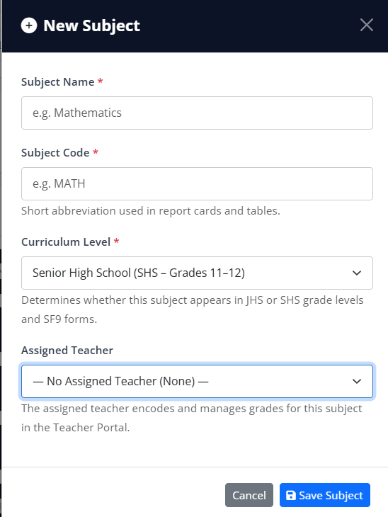
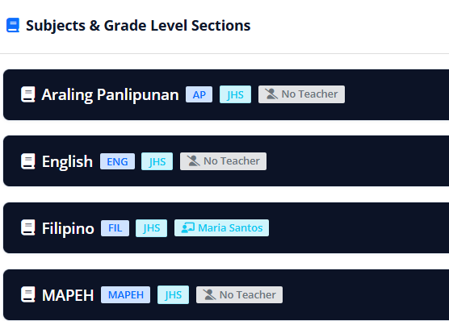

- http://localhost/OGMS-Lubo-National-High-School/views/admin/manage-grades.php
    - remove the Assigned Teacher that is not needed since we remove the advisory class already

- http://localhost/OGMS-Lubo-National-High-School/views/admin/manage-grades.php
    - remove the icon there for teacher also ok the no teacher the teacher that is assign since we remove that function

Teacher Portal
    - <button class="btn btn-outline-primary btn-sm py-1 px-2" onclick="printStudentSF9Report(93)" title="Print SF9 Report Card">
              <i class="fas fa-print me-1"></i>Print
            </button>
    - 

    remove those button ok just leave the button PRINT SECTION GRADE SHEET

    http://localhost/OGMS-Lubo-National-High-School/views/teacher/reports.php
    - remove those and change it with the printout of the PRINT GRADE SHEET of the manage grade ok
    

